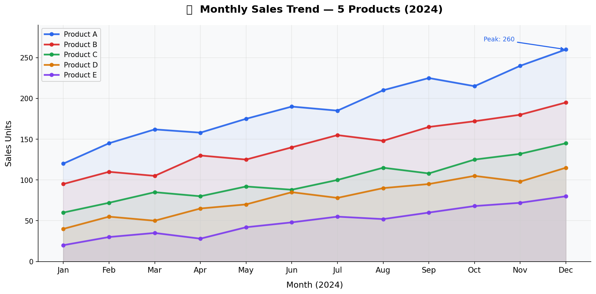
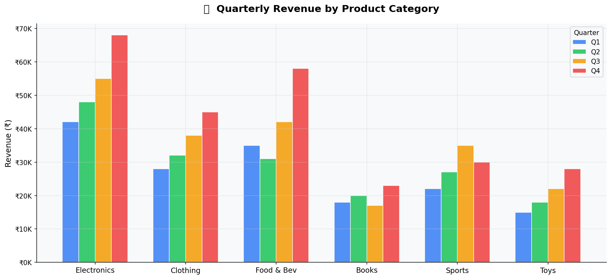
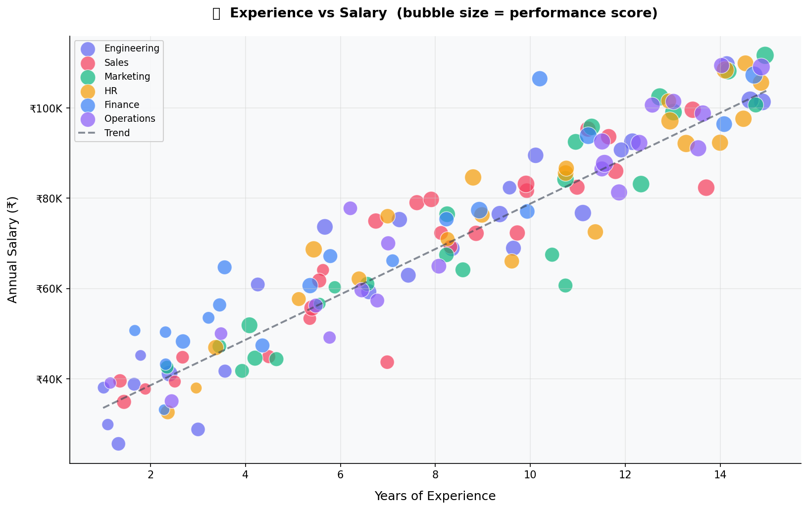
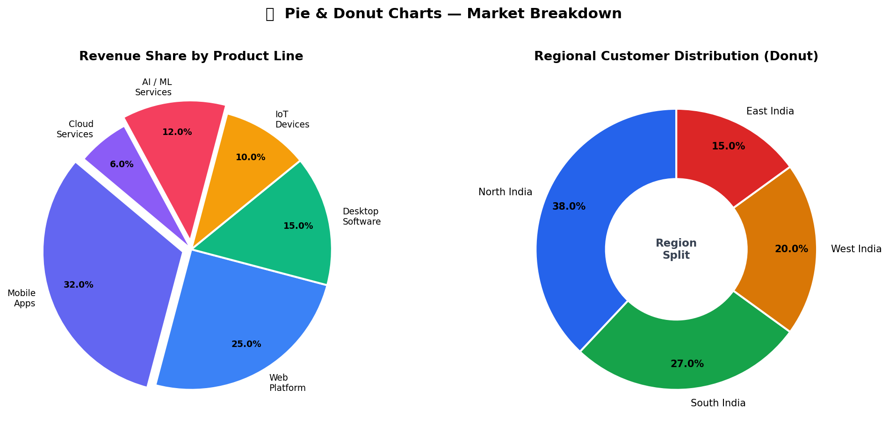
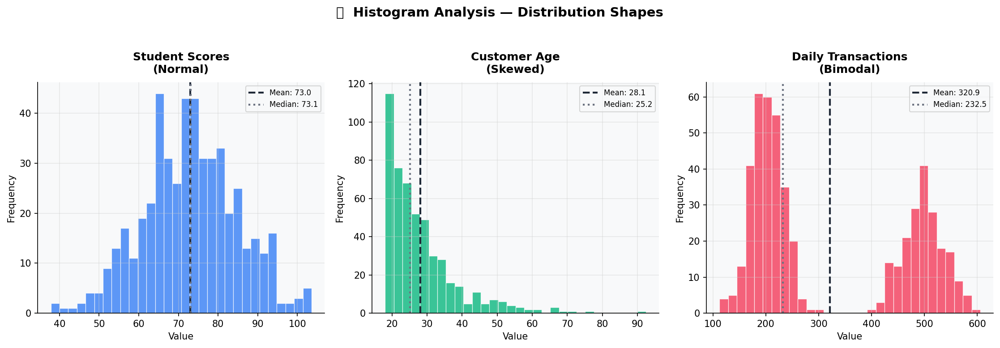
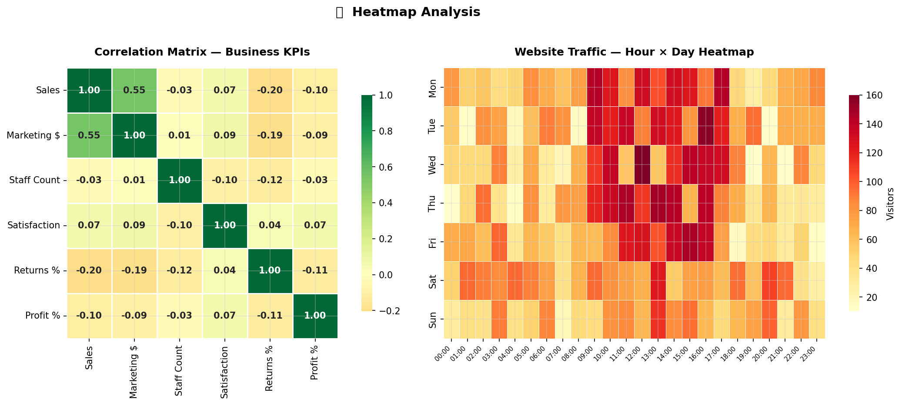

# 📊 Matplotlib Visualization Analysis

> Data visualization using **Matplotlib** & **Seaborn** — 6 plot types with real-world examples and analysis.

---

## 👤 Author

**Hemanth Selva A K**  
B.E. Computer Science & Engineering  
Bannari Amman Institute of Technology (BIT Sathy) | Batch 2022  
Role: Data Scientist

---

## 🛠️ Libraries Used

| Library | Purpose |
|---|---|
| `matplotlib` | Core plotting library |
| `seaborn` | Statistical data visualization |
| `numpy` | Numerical data generation |
| `pandas` | DataFrame for correlation matrix |

---

## 📊 Plot Types & Analysis

### 1. 📈 Line Plot — Monthly Sales Trend

Tracks 5 products' monthly sales across 2024. Best for visualizing **trends over time**, revealing growth patterns and seasonal spikes.

**Key Insight:** Product A peaks at 260 units in December, consistently outperforming others.

---

### 2. 📊 Bar Plot — Quarterly Revenue by Category

Grouped bar chart comparing Q1–Q4 revenue across 6 product categories. Best for **comparing discrete values** across multiple groups side by side.

**Key Insight:** Electronics generates the highest revenue across all quarters, peaking in Q4.

---

### 3. 🔵 Scatter Plot — Experience vs Salary

Bubble size represents performance score, colored by department. Best for finding **correlations** between two continuous variables with a 3rd dimension via bubble size.

**Key Insight:** Engineering and Finance show the steepest salary growth with experience.

---

### 4. 🥧 Pie + Donut Chart — Market Breakdown

Revenue share by product line (pie) and regional customer distribution (donut). Best for **part-of-whole** proportional analysis.

**Key Insight:** Mobile Apps lead at 32% revenue. North India dominates at 38% regional share.

---

### 5. 📉 Histogram — Distribution Shapes

Three histograms showing Normal, Skewed, and Bimodal distributions with Mean vs Median lines. Essential for understanding **data distribution** in EDA.

**Key Insight:** Transactions show a bimodal pattern — two distinct customer value clusters exist.

---

### 6. 🔥 Heatmap — Correlation Matrix + Traffic Analysis

Correlation matrix of business KPIs and website traffic by hour/day. Best for **pattern detection** across two dimensions simultaneously.

**Key Insight:** Marketing spend strongly correlates with Sales. Peak traffic falls on weekdays 9 AM–6 PM.

---

## 📌 Concepts Covered

- Line, Bar, Scatter, Pie, Donut, Histogram, Heatmap
- Custom color schemes, annotations, and light theme formatting
- Distribution analysis — Normal, Skewed, Bimodal
- Correlation matrix and time-based pattern detection

---

## 📝 License
MIT License

