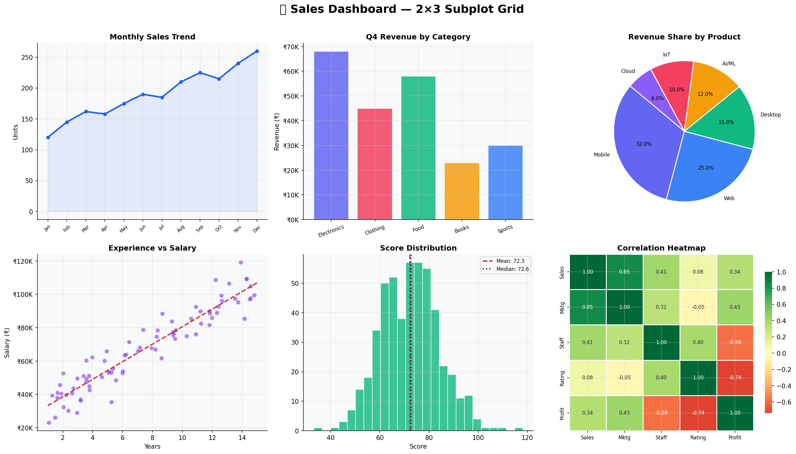
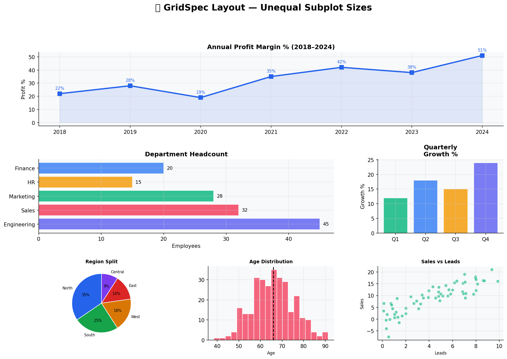
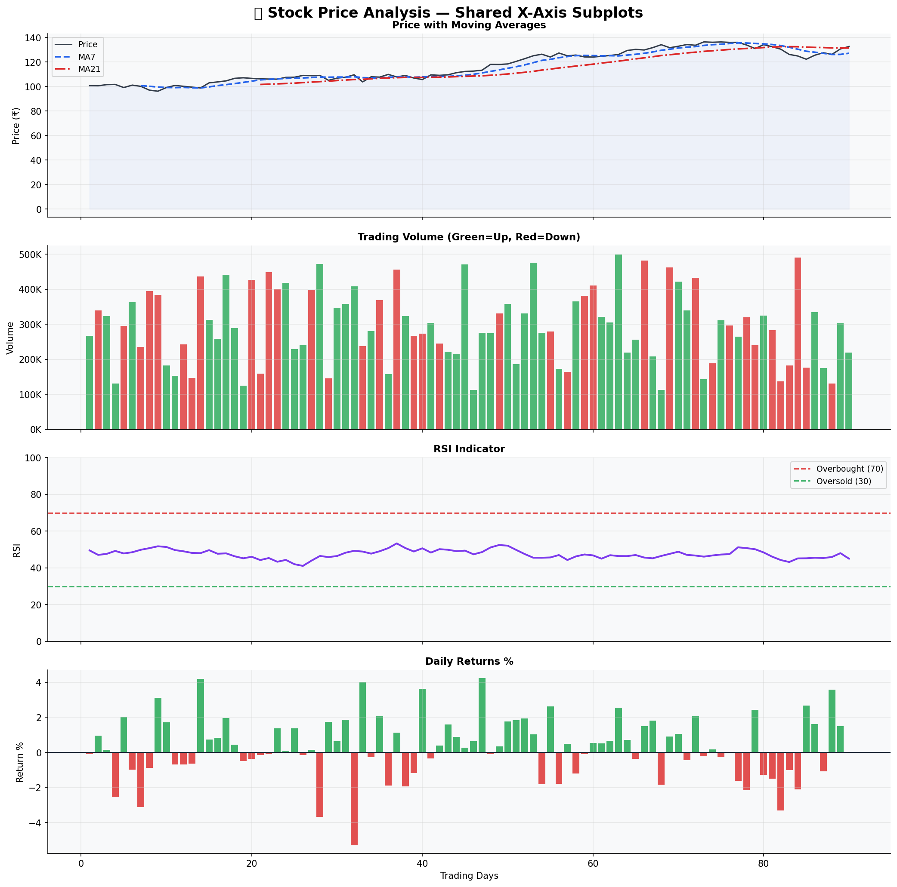
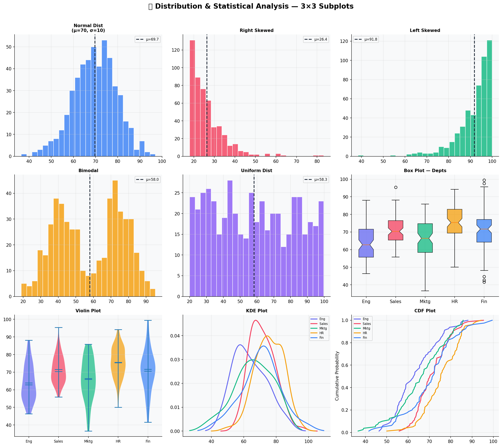
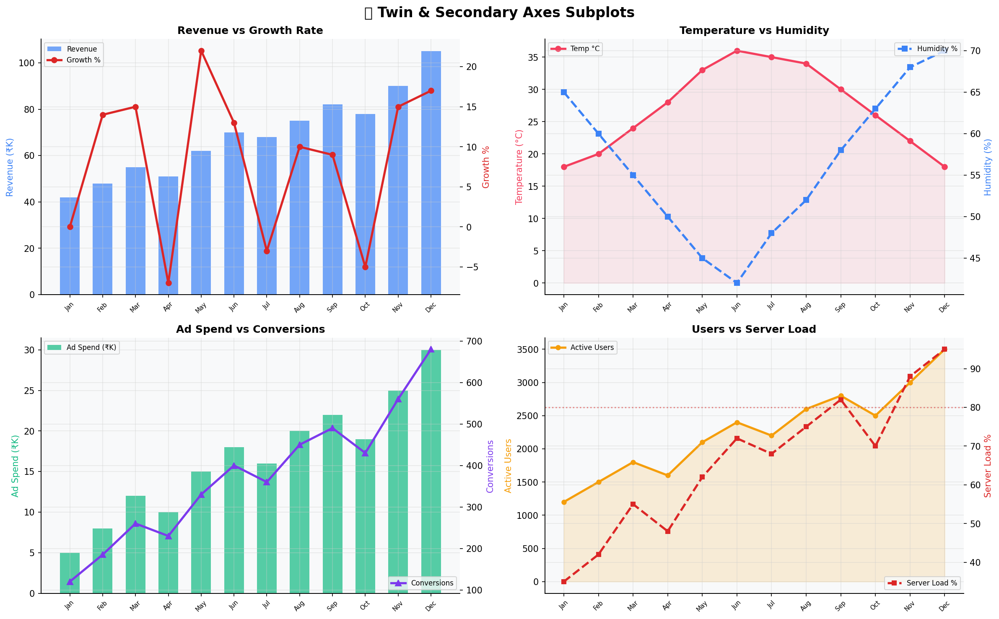

# 📐 Advanced Visualization with Subplots — Matplotlib

> Advanced subplot techniques using **Matplotlib** & **Seaborn** — 5 subplot types with real-world examples and analysis.

---

## 👤 Author

**Hemanth Selva A K**
B.E. Computer Science & Engineering
Bannari Amman Institute of Technology (BIT Sathy) | Batch 2022–2026
Role: Data Scientist

---

## 🛠️ Libraries Used

| Library | Purpose |
|---|---|
| `matplotlib` | Core plotting & subplot layout |
| `seaborn` | Statistical heatmaps |
| `numpy` | Numerical data generation |
| `pandas` | Rolling averages & correlation |
| `scipy` | KDE (Kernel Density Estimation) |

---

## 📊 Subplot Types & Analysis

### 1. 📊 2×3 Grid — Sales Dashboard

A 6-panel dashboard using plt.subplots(2, 3) combining Line, Bar, Pie, Scatter, Histogram, and Heatmap in one figure.

**Key Insight:** Unified dashboards allow quick cross-metric comparison without switching between charts.

---

### 2. 📐 GridSpec Layout — Unequal Subplot Sizes

Uses matplotlib.gridspec.GridSpec to create subplots of different sizes — wide top plot, medium middle, and small bottom plots.

**Key Insight:** GridSpec gives full control over subplot dimensions, ideal for executive-style dashboards.

---

### 3. 📈 Shared X-Axis — Stock Price Analysis

Four vertically stacked subplots sharing the same X-axis using sharex=True — Price + MA, Volume, RSI, and Daily Returns.

**Key Insight:** Shared axes keep time-series data aligned across all panels, making pattern correlation easy to spot.

---

### 4. 📉 3×3 Distribution Analysis

Nine subplots showing Normal, Skewed, Bimodal, Uniform distributions plus Box Plot, Violin Plot, KDE Plot, and CDF Plot.

**Key Insight:** Combining multiple distribution plots gives a complete statistical picture of the data.

---

### 5. 🔀 Twin & Secondary Axes — twinx()

Four subplots each using twinx() to overlay two metrics on the same plot with independent Y-axes.

**Key Insight:** Twin axes avoid separate charts when two metrics share the same X-axis but differ in scale.

---

## 📌 Concepts Covered

- plt.subplots(m, n) — Grid layout
- GridSpec — Unequal subplot sizing
- sharex=True — Shared axis across subplots
- twinx() — Dual Y-axis on same plot
- Box Plot, Violin Plot, KDE, CDF in subplots
- Custom annotations, color schemes, light theme

---

## 📝 License
MIT License
